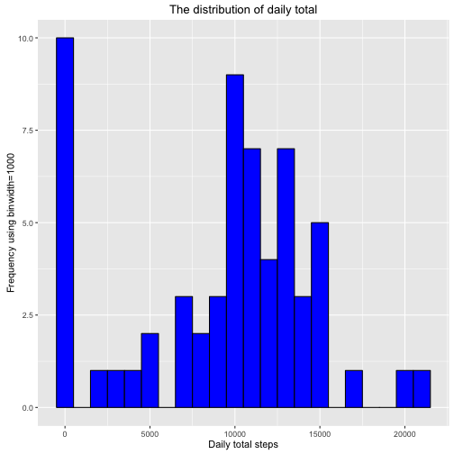
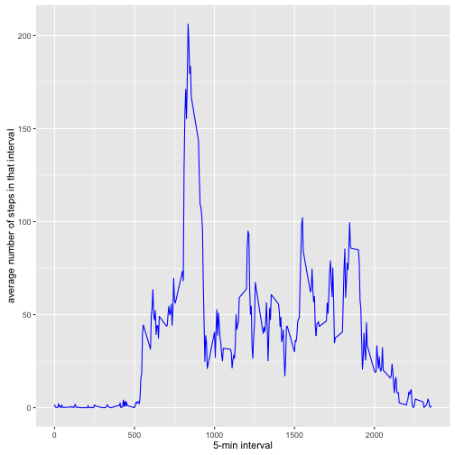
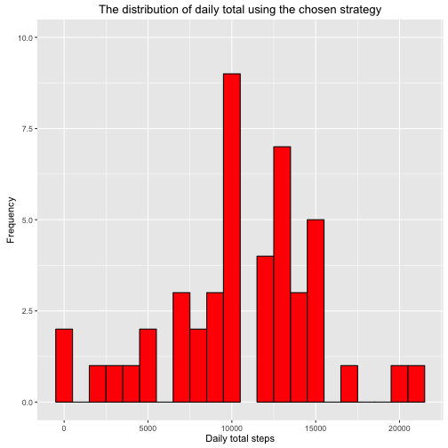
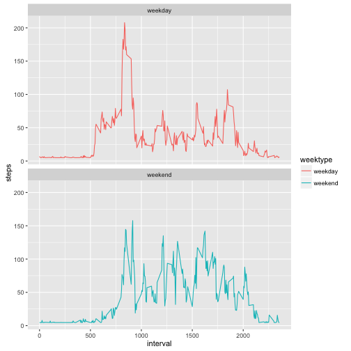

## Introduction
This assignment makes use of data from a personal activity monitoring device. This device collects data at 5 minute intervals through out the day. The data consists of two months of data from an anonymous individual collected during the months of October and November, 2012 and include the number of steps taken in 5 minute intervals each day.

This is a report for the Project Assignment 1 of the Coursera course Reproductive Research, written in a *single R markdown* document that can be processed by knitr and transformed into an HTML file.

## R preparations
Set the default of echo to be true so it can be reviewed the code by the peer.

```r
library(knitr)
```

```
## Warning: package 'knitr' was built under R version 3.3.2
```

```r
opts_chunk$set(echo=TRUE)
```

## Loading the necessary packages
### - dplyr: a grammar of data maniplation

```r
library(dplyr)
```

```
## 
## Attaching package: 'dplyr'
```

```
## The following objects are masked from 'package:stats':
## 
##     filter, lag
```

```
## The following objects are masked from 'package:base':
## 
##     intersect, setdiff, setequal, union
```

### - ggplot2: functions to create elegant data visualizations

```r
library(ggplot2)
```
### - Hmisc: for impuating the missing data

```r
library(Hmisc)
```

```
## Loading required package: lattice
```

```
## Loading required package: survival
```

```
## Loading required package: Formula
```

```
## 
## Attaching package: 'Hmisc'
```

```
## The following objects are masked from 'package:dplyr':
## 
##     combine, src, summarize
```

```
## The following objects are masked from 'package:base':
## 
##     format.pval, round.POSIXt, trunc.POSIXt, units
```

## Loading and preprocessing the data
Show any code that is needed to

1. Load the data (i.e. <f0><9d><9a><9b><f0><9d><9a><8e><f0><9d><9a><8a><f0><9d><9a><8d>.<f0><9d><9a><8c><f0><9d><9a><9c><f0><9d><9a><9f>())
2. Process/transform the data (if necessary) into a format suitable for your analysis

The code will check for the existance of "activity.zip" file in current directory. 
If not found, it will download it from [here](https://d396qusza40orc.cloudfront.net/repdata%2Fdata%2Factivity.zip) automatically. Then, it will check if "activity.csv" file exists or not. If not, it will unzip the "activity.zip" file. Then, it will use read.csv to read in the "activity.csv" file.


```r
if (!file.exists("activity.zip")) {
    fileurl = "https://d396qusza40orc.cloudfront.net/repdata%2Fdata%2Factivity.zip"
    download.file(url = fileurl, destfile = "./activity.zip", method = "curl")
}
if (!file.exists("activity.csv")) {
    unzip(zipfile="activity.zip")
}
activity_data <- read.csv("activity.csv", header=TRUE, sep=",", colClasses = c("integer", "character", "integer"), na.strings = "NA")
```

Check out "activity_data using <code style="color:red">str()</code> and <code style="color:red">head()</code>:


```r
str(activity_data)
```

```
## 'data.frame':	17568 obs. of  3 variables:
##  $ steps   : int  NA NA NA NA NA NA NA NA NA NA ...
##  $ date    : chr  "2012-10-01" "2012-10-01" "2012-10-01" "2012-10-01" ...
##  $ interval: int  0 5 10 15 20 25 30 35 40 45 ...
```
Observations:  

1. "activity_data$steps" contains <code>NA</code>.
2. "activity_data$date" is a vector of char.


```r
head(activity_data)
```

```
##   steps       date interval
## 1    NA 2012-10-01        0
## 2    NA 2012-10-01        5
## 3    NA 2012-10-01       10
## 4    NA 2012-10-01       15
## 5    NA 2012-10-01       20
## 6    NA 2012-10-01       25
```


##Tidying the data

Using  <code style="color:red">as.Date</code> to convert "activity_data\$date" column to the <code>date</code> type.  We assign "activity_data" to "activity" dataset and use it for the following analysis.


```r
activity_data$date <- as.Date(activity_data$date)
# assgin "activity_data"" data frame to "activity" data frame for analysis
activity <- activity_data
```

Check out "activity" data using <code style="color:red">str()</code> and <code style="color:red">head()</code>:


```r
str(activity)
```

```
## 'data.frame':	17568 obs. of  3 variables:
##  $ steps   : int  NA NA NA NA NA NA NA NA NA NA ...
##  $ date    : Date, format: "2012-10-01" "2012-10-01" ...
##  $ interval: int  0 5 10 15 20 25 30 35 40 45 ...
```


```r
head(activity)
```

```
##   steps       date interval
## 1    NA 2012-10-01        0
## 2    NA 2012-10-01        5
## 3    NA 2012-10-01       10
## 4    NA 2012-10-01       15
## 5    NA 2012-10-01       20
## 6    NA 2012-10-01       25
```

Eveything is ready and setup for solving some problems.


## What is mean total number of steps taken per day?
For this part of the assignment, you can ignore the missing values in the dataset.

1. Calculate the total number of steps taken per day

2. If you do not understand the difference between a histogram and a barplot, research the difference between them. Make a histogram of the total number of steps taken each day

3. Calculate and report the mean and median of the total number of steps taken per day


#####Methodology and Result

1. Calculate the total number of steps per day.


```r
stepByDate <- tapply(activity$steps, activity$date, FUN=sum, na.rm=TRUE)
```

2. Make a histogram of the total number of steps taken each day.


```r
qplot(stepByDate, geom="histogram", binwidth=1000, xlab="Daily total steps", ylab="Frequency using binwidth=1000", main = "The distribution of daily total", ylim=c(0,10), fill=I("blue"), col=I("black"))
```



3. Compute the mean and median of total steps taken each day.


```r
# mean of total steps taken each day
mean(stepByDate)
```

```
## [1] 9354.23
```

```r
# median of total steps taken each day
median(stepByDate)
```

```
## [1] 10395
```
Therefore, the mean is 9354 (cast to integer) steps and10395e, na.rm=TRUE)` steps.


##What is the average daily activity pattern?

1. Make a time series plot (i.e. <U+0001D69D><U+0001D6A2><U+0001D699><U+0001D68E> = "<U+0001D695>") of the 5-minute interval (x-axis) and the average number of steps taken, averaged across all days (y-axis)

2. Which 5-minute interval, on average across all the days in the dataset, contains the maximum number of steps?


#####Methodology and Result

First, we create a data frame <code>averagesPer5MinInterval</code> by using <code>aggregate</code> to aggregate the avergage steps (i.e. activity\$steps) over the 5-minute interval (i.e. activty\$interval).  

```r
averagesPer5MinInterval <- aggregate(x=list(steps=activity$steps), by=list(interval=activity$interval), FUN=mean, na.rm=T)
```

1. We make a time series plot of the 5-minute interval (x-axis) and the average number of steps taken, averaged across all days (y-axis). 


```r
ggplot(data=averagesPer5MinInterval, aes(x=interval, y=steps)) + geom_line(color = "blue") + xlab("5-min interval") + ylab("average number of steps in that interval")
```



2. Find out which 5-minute interval, on average across all the days in the dataset, contain the maximum number of steps:


```r
averagesPer5MinInterval[which.max(averagesPer5MinInterval$steps),]
```

```
##     interval    steps
## 104      835 206.1698
```

The 835-th interval has the max value of average number206.1698113ps),]$steps`).


## Imputing missing values
Note that there are a number of days/intervals where there are missing values (coded as <U+0001D67D><U+0001D670>). The presence of missing days may introduce bias into some calculations or summaries of the data.

1. Calculate and report the total number of missing values in the dataset (i.e. the total number of rows with <U+0001D67D><U+0001D670>s)

2. Devise a strategy for filling in all of the missing values in the dataset. The strategy does not need to be sophisticated. For example, you could use the mean/median for that day, or the mean for that 5-minute interval, etc.

3. Create a new dataset that is equal to the original dataset but with the missing data filled in.

4. Make a histogram of the total number of steps taken each day and Calculate and report the mean and median total number of steps taken per day. Do these values differ from the estimates from the first part of the assignment? What is the impact of imputing missing data on the estimates of the total daily number of steps?


#####Methodology and Result
1. Summarize all missing values from the original data set "activity_data":


```r
na_index <- is.na(activity_data$steps)
sum(na_index)
```

```
## [1] 2304
```

Total number of missing values is 2304.


2 & 3. We use the mean value as a simple strategy to fill all of the missing values in the data set. Create a new dataset called "activity_Imputed_data" using this strategy.


```r
# create a new dataset of the original dataset called "activity_Imputed_data" using mean
activity_Imputed_data <- activity_data
activity_Imputed_data$steps <- impute(activity_data$steps, fun=mean, na.rm=TRUE)
```

Check there is no more missing value:

```r
val <- sum(is.na(activity_Imputed_data$steps))
```

There is no more missing value in <code>activity_Imputed_data$steps</code>: TRUE

Check out the "activity_Imputed_data" data frame using <code style="color:red">str()</code> and <code style="color:red">head()</code>:


```r
str(activity_Imputed_data)
```

```
## 'data.frame':	17568 obs. of  3 variables:
##  $ steps   :Class 'impute'  atomic [1:17568] 37.4 37.4 37.4 37.4 37.4 ...
##   .. ..- attr(*, "imputed")= int [1:2304] 1 2 3 4 5 6 7 8 9 10 ...
##  $ date    : Date, format: "2012-10-01" "2012-10-01" ...
##  $ interval: int  0 5 10 15 20 25 30 35 40 45 ...
```


```r
head(activity_Imputed_data)
```

```
##     steps       date interval
## 1 37.3826 2012-10-01        0
## 2 37.3826 2012-10-01        5
## 3 37.3826 2012-10-01       10
## 4 37.3826 2012-10-01       15
## 5 37.3826 2012-10-01       20
## 6 37.3826 2012-10-01       25
```

Check mean of activity_Imputed_data$steps:

```r
mean(activity_Imputed_data$steps)
```

```
## [1] 37.3826
```

Check median of activity_Imputed_data$steps:

```r
median(activity_Imputed_data$steps)
```

```
## [1] 0
```

4. Make a histogram of the total number of steps taken each day using "activity_Imputed_data" data set.


```r
new.stepByDate <- tapply(activity_Imputed_data$steps, activity_Imputed_data$date, FUN=sum)
head(new.stepByDate)
```

```
## 2012-10-01 2012-10-02 2012-10-03 2012-10-04 2012-10-05 2012-10-06 
##   10766.19     126.00   11352.00   12116.00   13294.00   15420.00
```

```r
summary(new.stepByDate)
```

```
##    Min. 1st Qu.  Median    Mean 3rd Qu.    Max. 
##      41    9819   10770   10770   12810   21190
```


```r
qplot(new.stepByDate, geom="histogram", binwidth=1000, xlab="Daily total steps", ylab="Frequency", main = "The distribution of daily total using the chosen strategy", ylim=c(0,10), fill=I("red"), col=I("black"))
```



Yes, the value of mean and median has changed. The distribution of daily total has not changed much, at least the shape.

## Are there differences in activity patterns between weekdays and weekends?

For this part the <f0><9d><9a><a0><f0><9d><9a><8e><f0><9d><9a><8e><f0><9d><9a><94><f0><9d><9a><8d><f0><9d><9a><8a><f0><9d><9a><a2><f0><9d><9a><9c>() function may be of some help here. Use the dataset with the filled-in missing values for this part.

1. Create a new factor variable in the dataset with two levels <e2><80><93> <e2><80><9c>weekday<e2><80><9d> and <e2><80><9c>weekend<e2><80><9d> indicating whether a given date is a weekday or weekend day.

2. Make a panel plot containing a time series plot (i.e. <f0><9d><9a><9d><f0><9d><9a><a2><f0><9d><9a><99><f0><9d><9a><8e> = "<f0><9d><9a><95>") of the 5-minute interval (x-axis) and the average number of steps taken, averaged across all weekday days or weekend days (y-axis). See the README file in the GitHub repository to see an example of what this plot should look like using simulated data.

####Methodology and Result

1. We use <code style="color:red">dplyr</code> and <code style="color:red">mutate</code> to create a new column, <code>weektype</code>, and apply whether the day is weekend or weekday using <code style="color:red">weekdays</code>.


```r
activity_Imputed_data <- activity_Imputed_data %>% mutate("weektype"=ifelse(weekdays(activity_Imputed_data$date) == "Saturday" | weekdays(activity_Imputed_data$date) == "Sunday", "weekend", "weekday"))
activity_Imputed_data$weektype <- as.factor(activity_Imputed_data$weektype)
```

check "activity_Imputed_data" using <code style="color:red">head</code>.


```r
head(activity_Imputed_data)
```

```
##     steps       date interval weektype
## 1 37.3826 2012-10-01        0  weekday
## 2 37.3826 2012-10-01        5  weekday
## 3 37.3826 2012-10-01       10  weekday
## 4 37.3826 2012-10-01       15  weekday
## 5 37.3826 2012-10-01       20  weekday
## 6 37.3826 2012-10-01       25  weekday
```

2. Calculate the avg steps in the 5-min interval and use <code style="color:red">ggplot</code> to make the time series of the 5-min interval for weekeday and weekend, and compare the average steps:
    

```r
interval_full <- activity_Imputed_data %>% group_by(interval, weektype) %>% summarise(steps=mean(steps))

p <- ggplot(interval_full, aes(x=interval, y=steps, color=weektype)) + geom_line() + facet_wrap(~weektype, ncol=1, nrow=2)

print(p)
```




```r
weekday <- interval_full %>% filter(weektype=="weekday")
summary(weekday)
```

```
##     interval         weektype       steps        
##  Min.   :   0.0   weekday:288   Min.   :  4.984  
##  1st Qu.: 588.8   weekend:  0   1st Qu.:  6.907  
##  Median :1177.5                 Median : 25.762  
##  Mean   :1177.5                 Mean   : 35.611  
##  3rd Qu.:1766.2                 3rd Qu.: 49.940  
##  Max.   :2355.0                 Max.   :207.873
```

```r
sum(weekday$steps)
```

```
## [1] 10255.85
```

```r
weekend <- interval_full %>% filter(weektype=="weekend")
summary(weekend)
```

```
##     interval         weektype       steps        
##  Min.   :   0.0   weekday:  0   Min.   :  4.673  
##  1st Qu.: 588.8   weekend:288   1st Qu.:  5.642  
##  Median :1177.5                 Median : 32.704  
##  Mean   :1177.5                 Mean   : 42.366  
##  3rd Qu.:1766.2                 3rd Qu.: 70.798  
##  Max.   :2355.0                 Max.   :157.798
```

```r
sum(weekend$steps)
```

```
## [1] 12201.52
```

From the two plots above, it seems like that the object is more active earlier in the day during the weekdays compared to weekends. However, more active throughput the weekends compared with weekdays as examplifed by a fact where the total number of steps taken in the weekend 1.2201524 &times; 10<sup>4</sup> is greater than that in weekday 1.0255847 &times; 10<sup>4</sup>.
